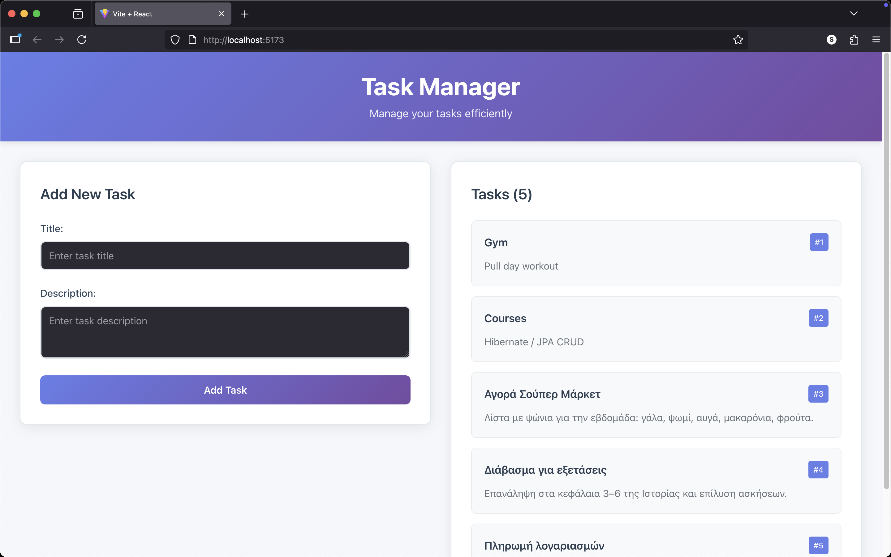
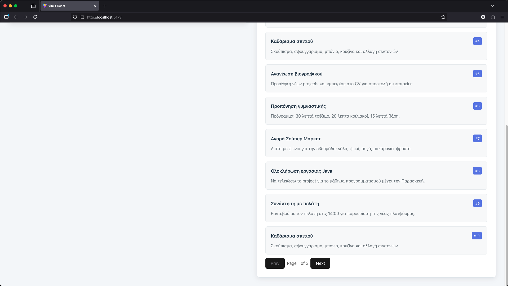

## Task Manager – Full Stack

This repository contains a simple Task Manager application with a React frontend and a Spring Boot backend.

The application allows users to create and view tasks. The frontend communicates with the backend over HTTP.

---

## Frontend (React + Vite)

### Project overview
The frontend enables users to:
- Create new tasks (title and description)
- View a list of existing tasks




It uses React 18 with Vite. Data is fetched via the native `fetch` API, handling loading and error states. Styling lives in `frontend/src/App.css` and `frontend/src/index.css`.

### Setup instructions

Prerequisites:
- Node.js 18+ and npm

1) Install dependencies
```bash
cd frontend
npm install
```

2) (Optional) Configure API base URL
By default, the frontend calls `http://localhost:8080`. To customize, create `.env`:
```bash
echo "VITE_API_URL=http://localhost:8080" > .env
```
If you wire a service layer to read `import.meta.env.VITE_API_URL`, the app can use this value as the backend base URL.

3) Start the development server
```bash
npm run dev
```
Open the printed URL (usually `http://localhost:5173`).

4) Build and preview
```bash
npm run build
npm run preview
```

---

## Backend (Spring Boot)

### Project overview
The backend exposes REST endpoints to create and retrieve tasks. It uses an in-memory H2 database for development.

Tech stack:
- Java 21
- Spring Boot
- Spring Web
- Spring Data JPA
- H2 Database (in-memory)

### Setup instructions

Prerequisites:
- Java 21 (or compatible JDK)
- Maven (or the Maven Wrapper)

1) Run the application (from the repository root or `backend` folder)
```bash
cd backend
./mvnw spring-boot:run
# or: mvn spring-boot:run
```

2) Base URL
- `http://localhost:8080`

3) H2 database console (optional)
- Visit `http://localhost:8080/h2-console/`
- JDBC URL/credentials are configured in `backend/src/main/resources/application.properties`.

4) CORS
- If serving the frontend from Vite (`http://localhost:5173`), ensure CORS allows that origin.

### API Endpoints

| Method | URL                          | Description        |
|--------|-------------------------------|--------------------|
| GET    | `http://localhost:8080/tasks` | Returns all tasks  |
| POST   | `http://localhost:8080/tasks` | Creates a new task |

Sample POST body:
```json
{
  "title": "Prepare presentation",
  "description": "Finalize slides for Monday's meeting"
}
```

### Package structure
- `controller` – REST controllers
- `service` – Business logic (interfaces/implementations)
- `repository` – Spring Data JPA repositories
- `model` – JPA entities
