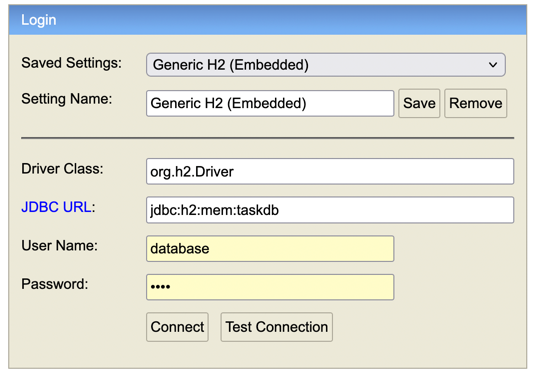
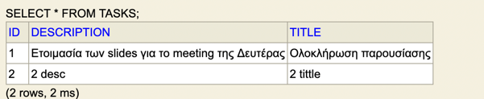

- Java 21
- Spring Boot
- Spring Web
- Spring Data JPA
- H2 Database


## Endpoints

| Μέθοδος | URL        | Περιγραφή               |
|--------|------------|-------------------------|
| GET    | `http://localhost:8080/tasks`   | Επιστρέφει όλα τα tasks |
| POST   | `http://localhost:8080/tasks`   | Δημιουργεί νέο task     |

## Packages
- Controller
- Model
- Repository
- Service

###  Παράδειγμα JSON για POST

```json
{
  "title": "Ολοκλήρωση παρουσίασης",
  "description": "Ετοιμασία των slides για το meeting της Δευτέρας"
}
```

Πως συνδέομαι στην βάση, path http://localhost:8080/h2-console/ :


Δεδομένα στην βάση:



