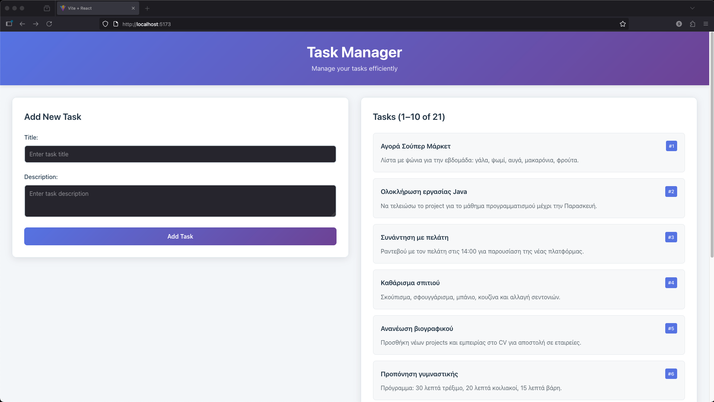

## Task Manager – Frontend (React + Vite)

### Project overview
This is the frontend of a simple Task Manager application built with React and Vite. It allows users to:
- Create new tasks (title and description)
- View a list of existing tasks




The app communicates with a backend API (Spring Boot) over HTTP. By default, it expects the backend to be available at `http://localhost:8080` and expose a `GET /tasks` endpoint to retrieve tasks and a `POST /tasks` endpoint to create new ones.

Key points:
- Tech: React 18, Vite 5, modern ES modules
- Data fetching: native `fetch` API with loading and error states
- Components:
  - `TaskForm`: submit new tasks via `POST /tasks`
  - `TaskList`: display tasks, loading, empty, and error states
- Basic styling included in `src/App.css` and `src/index.css`

### Setup instructions

Prerequisites:
- Node.js 18+ and npm
- Backend API running locally (Spring Boot) on `http://localhost:8080`

1) Install dependencies
```bash
npm install
```

2) (Optional) Configure API base URL
- By default, the app calls `http://localhost:8080`. To change it, create a `.env` file in this folder and set:
```bash
echo "VITE_API_URL=http://localhost:8080" > .env
```
- You can then reference `import.meta.env.VITE_API_URL` inside the code if you wire it up in a small service layer.

3) Start the development server
```bash
npm run dev
```
- Open the printed URL (usually `http://localhost:5173`).

4) Build for production
```bash
npm run build
```

5) Preview the production build locally
```bash
npm run preview
```

### Backend expectations
- Must allow CORS from the Vite dev server (e.g., `http://localhost:5173`).
- Exposes the following endpoints:
  - `GET /tasks` → returns an array of tasks like `{ id, title, description }`
  - `POST /tasks` → creates a new task from `{ title, description }` and returns the created task
- If the backend is down or CORS is not configured, the UI will show a connection error.

### Common issues
- CORS errors: Ensure the backend enables CORS for the frontend origin.
- Connection errors: Verify the backend is running on the expected port and endpoints.
- Port conflicts: If Vite’s default port (5173) is in use, Vite will select another; use the printed URL.
